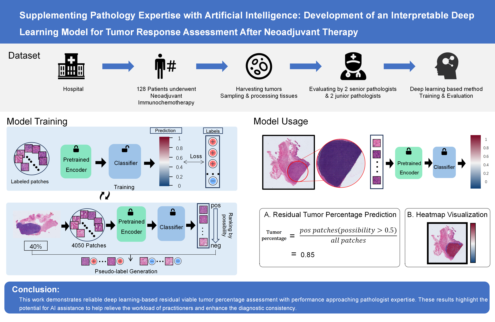

# Development of an Interpretable Deep Learning Model for Pathological Tumor Response Assessment After Neoadjuvant Therapy

This repository contains PyTorch code for the paper:
Development of an Interpretable Deep Learning Model for Pathological Tumor Response Assessment After Neoadjuvant Therapy

This work illustrates deep learning's potential for assisting pathological response assessment. Spatial heatmaps and patch examples provide intuitive explanations of model predictions, engendering clinical trust and adoption. Integrating interpretable computational pathology could help enhance efficiency and consistency of tumor response assessment and empower precise oncology treatment decisions.




Links to the checkpoints will be uploaded once the paper got accepted.


## Citation

If any part of this code is used, please give appropriate citation to our paper. <br />

```
@ARTICLE{9869632,
  author={Wang Yichen, Zhang Wenhua, Chen Lijun, Xie Jun, Zheng Xuebin, Jian Yan, Zheng Qiang, Xue Qianqian, Li Bin, He Chuan, Chen Haiquan, Li Yuan},
  journal={}, 
  title={Development of an Interpretable Deep Learning Model for Pathological Tumor Response Assessment After Neoadjuvant Therapy}, 
  year={2022},
  volume={},
  number={},
  pages={1-1},
  doi={}}
```

## Authors

* [Wenhua Zhang](https://github.com/WinnieLaugh)

## License

The dataset provided here is for research purposes only. Commercial use is not allowed. The data is held under the following license:
[Attribution-NonCommercial-ShareAlike 4.0 International](https://creativecommons.org/licenses/by-nc-sa/4.0/)


